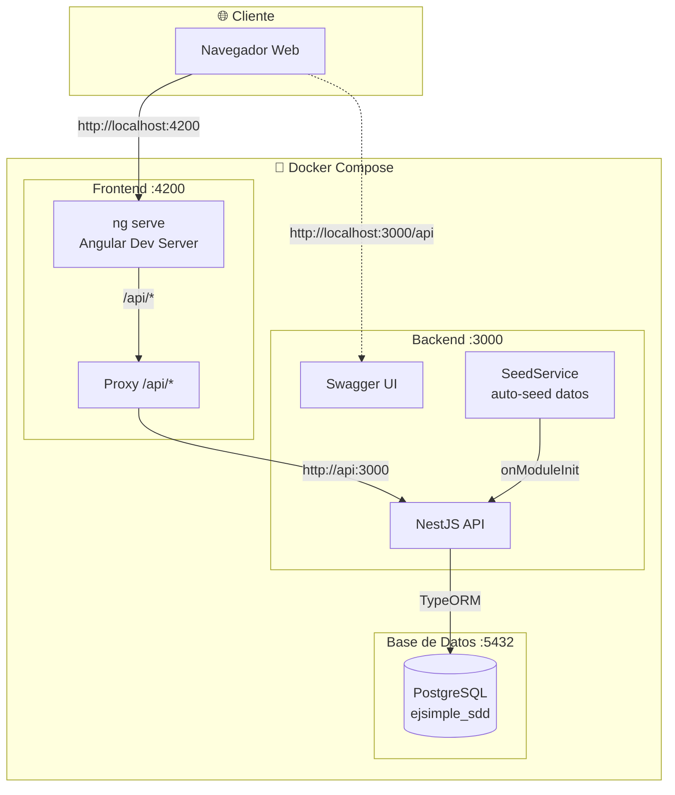
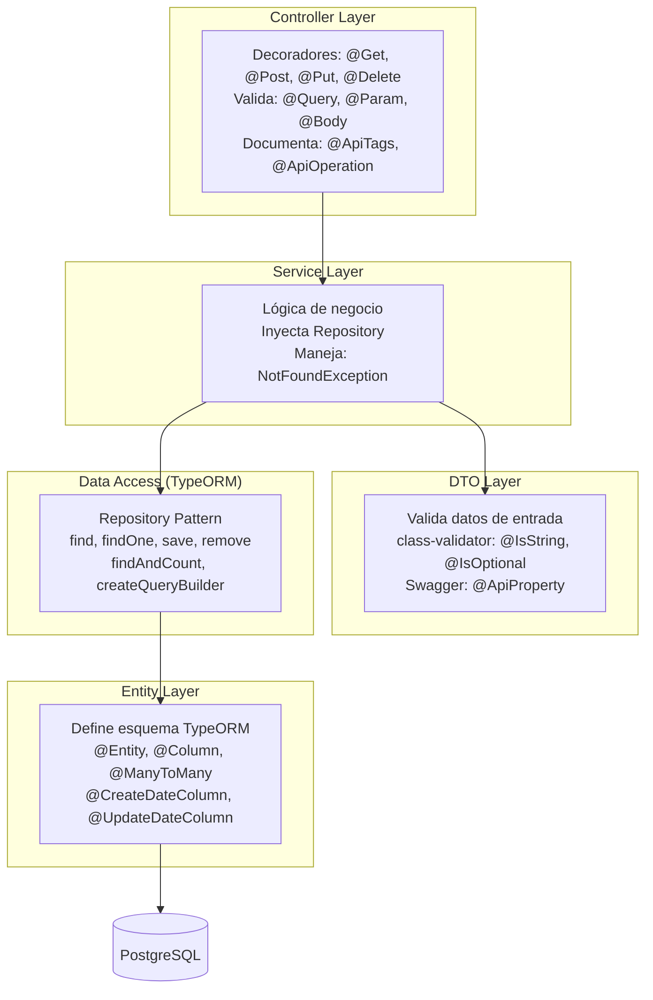
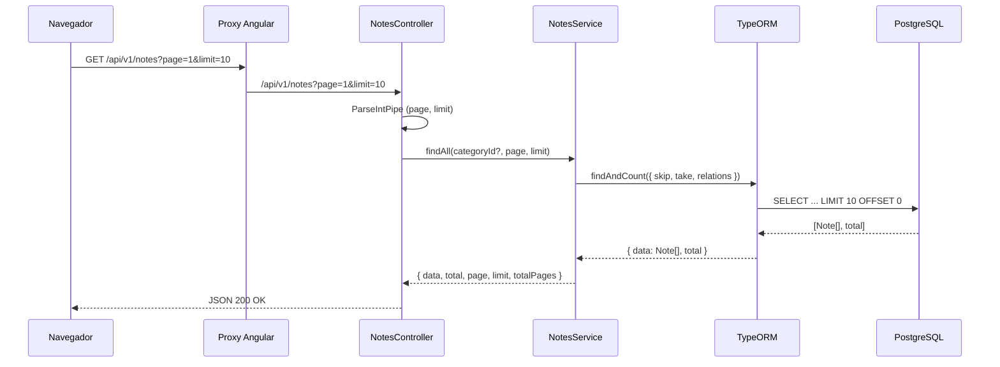
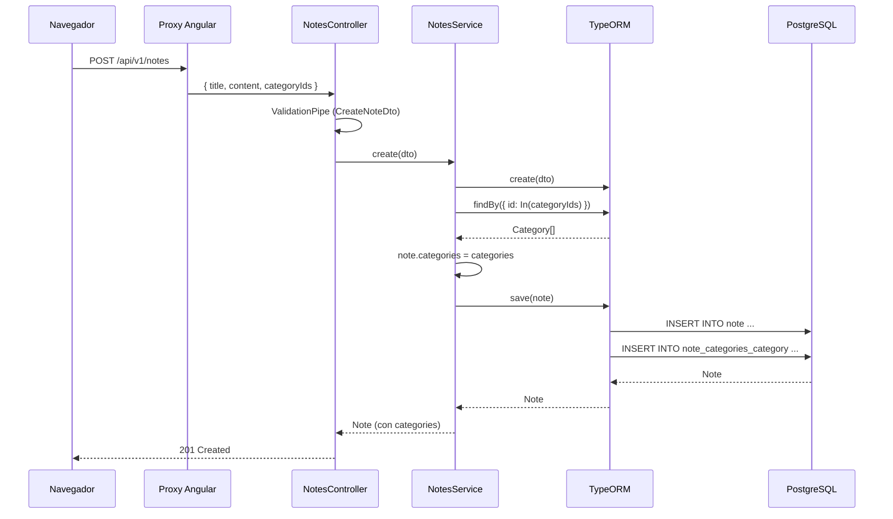
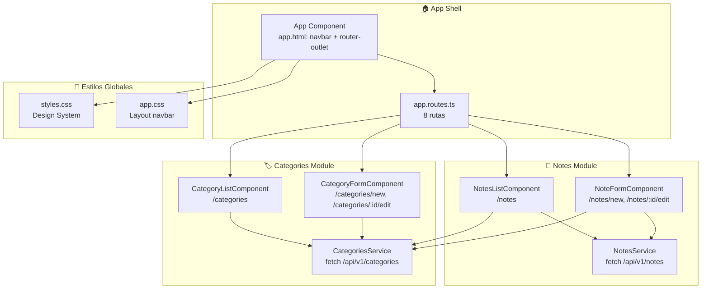
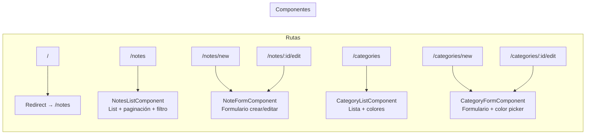
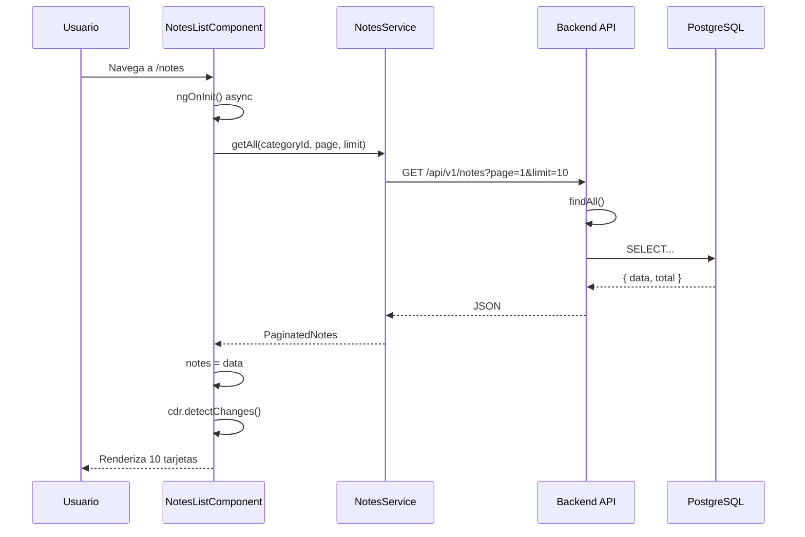
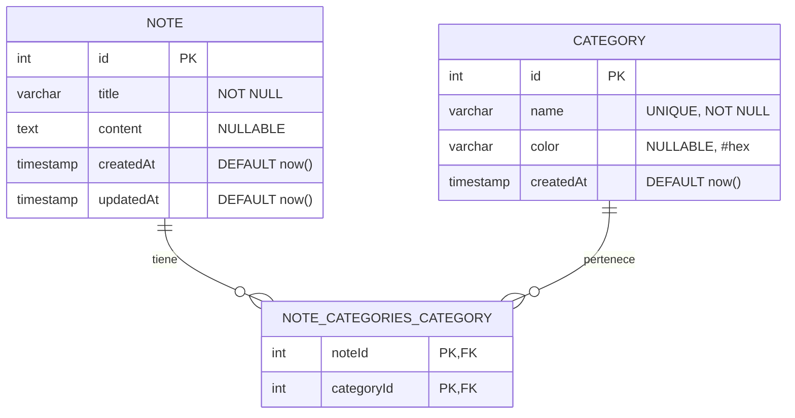

# ejsimple-sdd — Personal Notes App

Aplicación de notas personales con categorías. Proyecto demo desarrollado con **OpenSpec SDD** (Specification-Driven Development).

## Stack

| Capa       | Tecnología                        | Documentación              |
|------------|-----------------------------------|----------------------------|
| Backend    | NestJS 11 + TypeORM + PostgreSQL  | Swagger en `/api`          |
| Frontend   | Angular 21 (standalone)           | `ui/src/app/`              |
| Base datos | PostgreSQL 17                     | Esquema auto-generado      |
| Contenedor | Docker Compose                    | `docker-compose.yml`       |

---

## Arquitectura General



---

## Arquitectura Backend (NestJS)

```mermaid
graph LR
    subgraph "📦 NotesModule"
        NC[NotesController<br/>src/notes/notes.controller.ts]
        NS[NotesService<br/>src/notes/notes.service.ts]
        NE[Note Entity<br/>src/notes/notes.entity.ts]
        NCDTO[CreateNoteDto]
        NUDTO[UpdateNoteDto]
    end

    subgraph "📦 CategoriesModule"
        CC[CategoriesController<br/>src/categories/categories.controller.ts]
        CS[CategoriesService<br/>src/categories/categories.service.ts]
        CE[Category Entity<br/>src/categories/category.entity.ts]
        CCDTO[CreateCategoryDto]
        CUDTO[UpdateCategoryDto]
    end

    subgraph "📦 SeedModule"
        SS[SeedService<br/>src/seed/seed.service.ts]
    end

    subgraph "📦 AppModule"
        AM[AppModule<br/>src/app.module.ts]
        TORM[TypeORM Config]
    end

    subgraph "🗄️ PostgreSQL"
        NOTA[note]
        CAT[category]
        JN[note_categories_category]
    end

    NC --> NS --> NE
    NS --> NOTA
    NS --> CAT
    
    CC --> CS --> CE
    CS --> CAT

    SS --> NE
    SS --> CE

    AM --> TORM --> PG[(PostgreSQL)]
    TORM -.->|synchronize: true| NOTA
    TORM -.->|synchronize: true| CAT
    TORM -.->|synchronize: true| JN

    NE -->|@JoinTable| JN
    CE -->|inverse| JN
```

### Capas del Backend



### Flujo de una Petición (ej: GET /api/v1/notes)



### Flujo de Creación (ej: POST /api/v1/notes)



---

## Arquitectura Frontend (Angular)



### Componentes y Rutas



### Flujo de Carga de Datos



---

## Base de Datos

### Diagrama Entidad-Relación



### Diccionario de Datos

#### Tabla: `note`

| Columna     | Tipo                  | Restricciones        | Descripción                             |
|-------------|-----------------------|----------------------|-----------------------------------------|
| `id`        | `SERIAL`              | `PRIMARY KEY`        | Identificador único auto-incremental    |
| `title`     | `VARCHAR(255)`        | `NOT NULL`           | Título de la nota                       |
| `content`   | `TEXT`                | `NULLABLE`           | Contenido opcional de la nota           |
| `createdAt` | `TIMESTAMP`           | `NOT NULL DEFAULT NOW()` | Fecha de creación                  |
| `updatedAt` | `TIMESTAMP`           | `NOT NULL DEFAULT NOW()` | Fecha de última actualización       |

```sql
CREATE TABLE note (
  id        SERIAL       PRIMARY KEY,
  title     VARCHAR(255) NOT NULL,
  content   TEXT,
  "createdAt" TIMESTAMP  NOT NULL DEFAULT NOW(),
  "updatedAt" TIMESTAMP  NOT NULL DEFAULT NOW()
);
```

#### Tabla: `category`

| Columna     | Tipo                  | Restricciones              | Descripción                           |
|-------------|-----------------------|----------------------------|---------------------------------------|
| `id`        | `SERIAL`              | `PRIMARY KEY`              | Identificador único auto-incremental  |
| `name`      | `VARCHAR(100)`        | `NOT NULL UNIQUE`          | Nombre de la categoría                |
| `color`     | `VARCHAR(7)`          | `NULLABLE`                 | Color hexadecimal (ej: `#4f46e5`)     |
| `createdAt` | `TIMESTAMP`           | `NOT NULL DEFAULT NOW()`   | Fecha de creación                     |

```sql
CREATE TABLE category (
  id        SERIAL        PRIMARY KEY,
  name      VARCHAR(100)  NOT NULL UNIQUE,
  color     VARCHAR(7),
  "createdAt" TIMESTAMP   NOT NULL DEFAULT NOW()
);
```

#### Tabla: `note_categories_category`

| Columna      | Tipo      | Restricciones                               | Descripción                     |
|--------------|-----------|---------------------------------------------|---------------------------------|
| `noteId`     | `INTEGER` | `PRIMARY KEY`, `FK → note(id) ON DELETE CASCADE` | ID de la nota             |
| `categoryId` | `INTEGER` | `PRIMARY KEY`, `FK → category(id)`          | ID de la categoría              |

```sql
CREATE TABLE note_categories_category (
  "noteId"     INTEGER NOT NULL REFERENCES note(id) ON DELETE CASCADE,
  "categoryId" INTEGER NOT NULL REFERENCES category(id),
  PRIMARY KEY ("noteId", "categoryId")
);
```

---

## Cómo Ejecutar

### Con Docker (recomendado)

```bash
# Clonar y ejecutar
git clone <repo-url>
cd ejsimple-sdd
docker compose up --build -d

# Abrir en navegador
open http://localhost:4200

# Ver API docs
open http://localhost:3000/api
```

Al primer inicio, el `SeedService` llena la base de datos con 12 notas y 4 categorías de ejemplo.

### Sin Docker (desarrollo local)

**Requisitos:** Node.js 22+, PostgreSQL 17+

```bash
# 1. Crear base de datos
createdb ejsimple_sdd

# 2. Backend
cd api
npm install
npm run start:dev     # http://localhost:3000

# 3. Frontend (otra terminal)
cd ui
npm install
npm start             # http://localhost:4200
```

---

## API REST

Documentación interactiva: [`http://localhost:3000/api`](http://localhost:3000/api) (Swagger UI)

### Notas — `/api/v1/notes`

| Método  | Ruta                | Descripción                            | Parámetros                          |
|---------|---------------------|----------------------------------------|-------------------------------------|
| `GET`   | `/api/v1/notes`     | Listar notas (paginado)                | `?page=1&limit=10&categoryId=1`     |
| `GET`   | `/api/v1/notes/:id` | Obtener nota por ID                    | -                                   |
| `POST`  | `/api/v1/notes`     | Crear nota                             | `{ title, content?, categoryIds? }` |
| `PUT`   | `/api/v1/notes/:id` | Actualizar nota                        | `{ title?, content?, categoryIds? }`|
| `DELETE`| `/api/v1/notes/:id` | Eliminar nota                          | -                                   |

### Categorías — `/api/v1/categories`

| Método  | Ruta                    | Descripción                     | Parámetros                   |
|---------|-------------------------|---------------------------------|------------------------------|
| `GET`   | `/api/v1/categories`    | Listar categorías               | -                            |
| `GET`   | `/api/v1/categories/:id`| Obtener categoría por ID        | -                            |
| `POST`  | `/api/v1/categories`    | Crear categoría                 | `{ name, color? }`           |
| `PUT`   | `/api/v1/categories/:id`| Actualizar categoría            | `{ name?, color? }`          |
| `DELETE`| `/api/v1/categories/:id`| Eliminar categoría              | -                            |

---

## Pruebas con curl

Una vez que la app esté corriendo (`docker compose up --build -d`), ejecutá estos comandos en orden para probar el CRUD completo:

```bash
echo "============================================"
echo " 1. CREAR CATEGORÍAS"
echo "============================================"

curl -s -X POST http://localhost:4200/api/v1/categories \
  -H "Content-Type: application/json" \
  -d '{"name":"Trabajo","color":"#4f46e5"}' | python3 -m json.tool

curl -s -X POST http://localhost:4200/api/v1/categories \
  -H "Content-Type: application/json" \
  -d '{"name":"Personal","color":"#10b981"}' | python3 -m json.tool

curl -s -X POST http://localhost:4200/api/v1/categories \
  -H "Content-Type: application/json" \
  -d '{"name":"Salud","color":"#ef4444"}' | python3 -m json.tool

echo ""
echo "============================================"
echo " 2. LISTAR CATEGORÍAS (deberían verse 3)"
echo "============================================"

curl -s http://localhost:4200/api/v1/categories | python3 -m json.tool

echo ""
echo "============================================"
echo " 3. CREAR NOTAS CON Y SIN CATEGORÍAS"
echo "============================================"

curl -s -X POST http://localhost:4200/api/v1/notes \
  -H "Content-Type: application/json" \
  -d '{"title":"Comprar víveres","content":"Leche, pan, huevos, fruta","categoryIds":[1,2]}' | python3 -m json.tool

curl -s -X POST http://localhost:4200/api/v1/notes \
  -H "Content-Type: application/json" \
  -d '{"title":"Leer documentación","content":"NestJS y Angular","categoryIds":[1]}' | python3 -m json.tool

curl -s -X POST http://localhost:4200/api/v1/notes \
  -H "Content-Type: application/json" \
  -d '{"title":"Nota rápida sin categoría"}' | python3 -m json.tool

echo ""
echo "============================================"
echo " 4. LISTAR NOTAS (deberían verse 3)"
echo "============================================"

curl -s "http://localhost:4200/api/v1/notes?page=1&limit=10" | python3 -m json.tool

echo ""
echo "============================================"
echo " 5. FILTRAR NOTAS POR CATEGORÍA (Trabajo = 1)"
echo "============================================"

curl -s "http://localhost:4200/api/v1/notes?categoryId=1" | python3 -m json.tool

echo ""
echo "============================================"
echo " 6. OBTENER NOTA POR ID"
echo "============================================"

curl -s http://localhost:4200/api/v1/notes/1 | python3 -m json.tool

echo ""
echo "============================================"
echo " 7. ACTUALIZAR NOTA (cambiar título + categorías)"
echo "============================================"

curl -s -X PUT http://localhost:4200/api/v1/notes/1 \
  -H "Content-Type: application/json" \
  -d '{"title":"Comprar víveres (actualizado)","categoryIds":[2]}' | python3 -m json.tool

echo ""
echo "============================================"
echo " 8. ACTUALIZAR CATEGORÍA (cambiar color)"
echo "============================================"

curl -s -X PUT http://localhost:4200/api/v1/categories/1 \
  -H "Content-Type: application/json" \
  -d '{"name":"Oficina","color":"#1a73e8"}' | python3 -m json.tool

echo ""
echo "============================================"
echo " 9. ELIMINAR NOTA"
echo "============================================"

curl -s -o /dev/null -w "HTTP %{http_code} (204 = OK)\n" -X DELETE http://localhost:4200/api/v1/notes/3

echo ""
echo "============================================"
echo " 10. VERIFICAR QUE SE ELIMINÓ (3 notas menos)"
echo "============================================"

curl -s "http://localhost:4200/api/v1/notes?page=1&limit=10" | python3 -c "
import json,sys
d = json.load(sys.stdin)
print(f'Total notas restantes: {d[\"total\"]}')
for n in d['data']:
    cats = ', '.join(c['name'] for c in n['categories']) if n['categories'] else 'sin categoría'
    print(f'  [{n[\"id\"]}] {n[\"title\"]} ({cats})')
"

echo ""
echo "============================================"
echo " 11. ELIMINAR CATEGORÍA"
echo "============================================"

curl -s -o /dev/null -w "HTTP %{http_code} (204 = OK)\n" -X DELETE http://localhost:4200/api/v1/categories/3

echo ""
echo "============================================"
echo " 12. VERIFICAR CATEGORÍAS RESTANTES"
echo "============================================"

curl -s http://localhost:4200/api/v1/categories | python3 -m json.tool

echo ""
echo "============================================"
echo " ✅ PRUEBAS COMPLETADAS"
echo "============================================"
```

### Prueba desde el navegador

| Acción                              | URL                                        |
|-------------------------------------|--------------------------------------------|
| Ver lista de notas                  | `http://localhost:4200/notes`               |
| Crear nota                          | `http://localhost:4200/notes/new`           |
| Filtrar por categoría               | En la lista, seleccionar categoría          |
| Navegar páginas                     | Botones "Anterior" / "Siguiente"            |
| Ver categorías                      | `http://localhost:4200/categories`          |
| Crear/editar categoría              | `http://localhost:4200/categories/new`      |
| Documentación API (Swagger)         | `http://localhost:3000/api`                 |

---

## OpenSpec SDD

Este proyecto sigue la metodología **OpenSpec SDD** (Specification-Driven Development).

| Directorio                         | Contenido                                                |
|------------------------------------|----------------------------------------------------------|
| `openspec/specs/notes/spec.md`     | Especificación Gherkin del módulo de notas               |
| `openspec/specs/categories/spec.md`| Especificación Gherkin del módulo de categorías          |
| `openspec/changes/archive/`        | Propuestas, diseños y tareas de cada cambio implementado |

Ver [`openspec/README.md`](./openspec/README.md) para más detalles.

---

## Estructura del Proyecto

```
ejsimple-sdd/
├── api/                   # Backend NestJS
│   ├── src/
│   │   ├── notes/         # Módulo de notas
│   │   ├── categories/    # Módulo de categorías
│   │   ├── seed/          # Seed automático de datos
│   │   ├── app.module.ts  # Módulo principal
│   │   └── main.ts        # Punto de entrada
│   ├── Dockerfile         # Imagen Docker multi-stage
│   └── package.json
├── ui/                    # Frontend Angular
│   ├── src/app/
│   │   ├── notes/         # Componentes y servicio de notas
│   │   ├── categories/    # Componentes y servicio de categorías
│   │   ├── app.ts         # Componente raíz
│   │   └── app.routes.ts  # Configuración de rutas
│   ├── Dockerfile         # Imagen Docker dev mode
│   └── package.json
├── openspec/              # Especificaciones SDD
│   ├── specs/             # Especificaciones activas
│   └── changes/           # Historial de cambios
├── .opencode/             # Configuración agente opencode
├── docker-compose.yml     # Orquestación Docker
└── README.md              # Este archivo
```

---

## Tecnologías

| Tecnología     | Versión  | Propósito                         |
|----------------|----------|-----------------------------------|
| NestJS         | 11       | Framework backend (Node.js)        |
| TypeORM        | 1.0      | ORM para PostgreSQL                |
| PostgreSQL     | 17       | Base de datos relacional           |
| Angular        | 21       | Framework frontend (standalone)    |
| Docker Compose | v5       | Orquestación de contenedores       |
| Swagger        | 11       | Documentación automática de API    |
| class-validator| 0.15     | Validación de DTOs                 |
