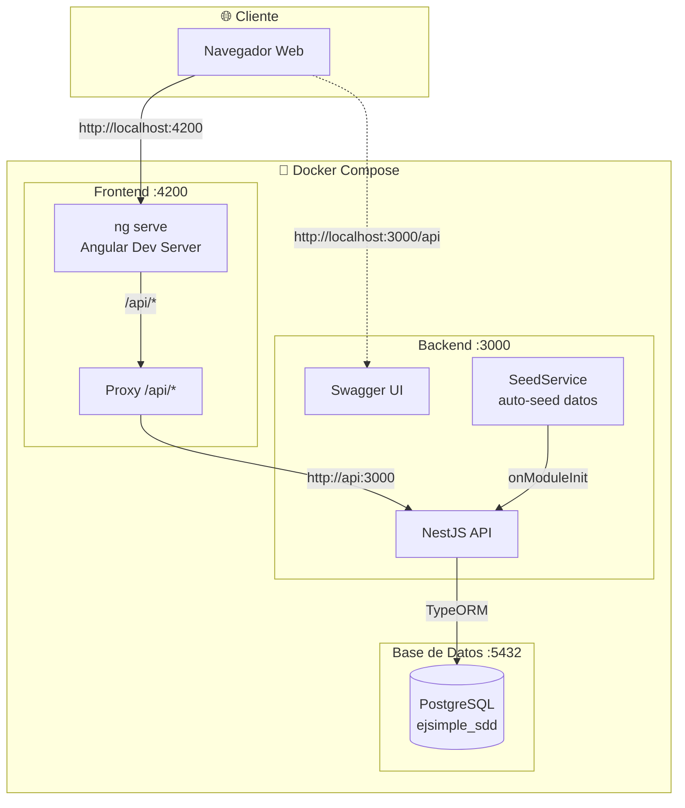
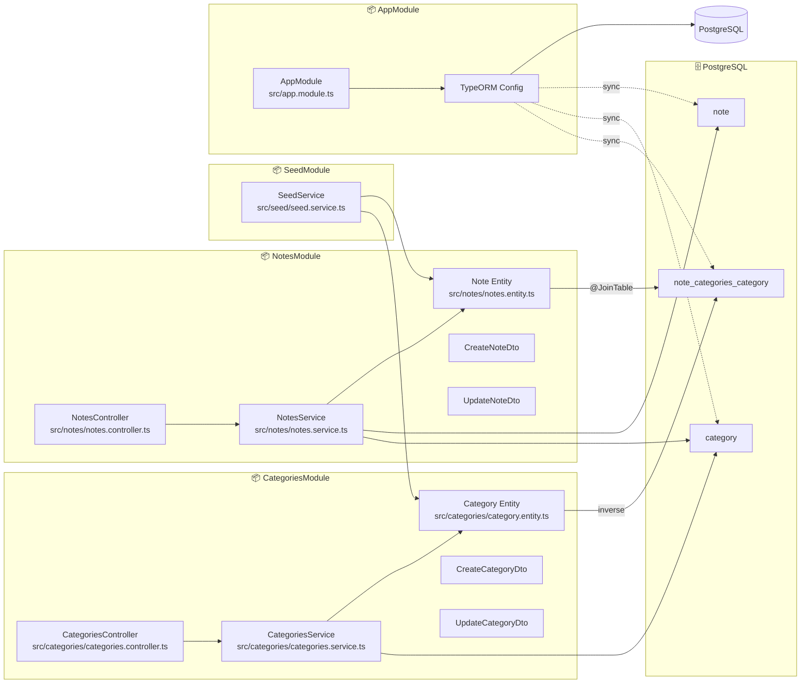
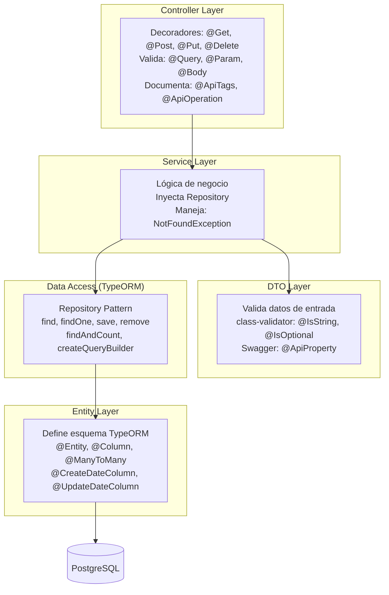
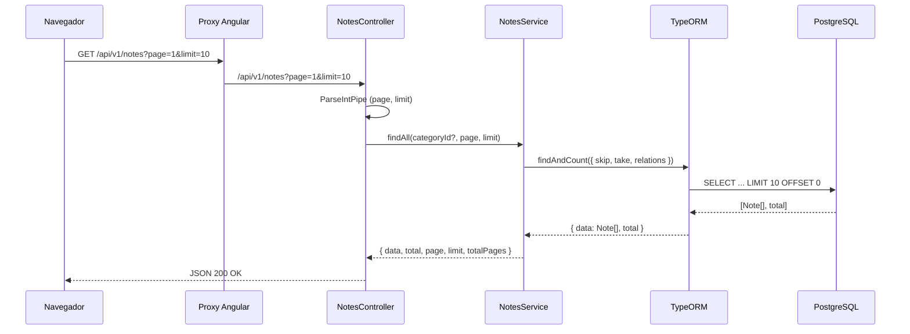
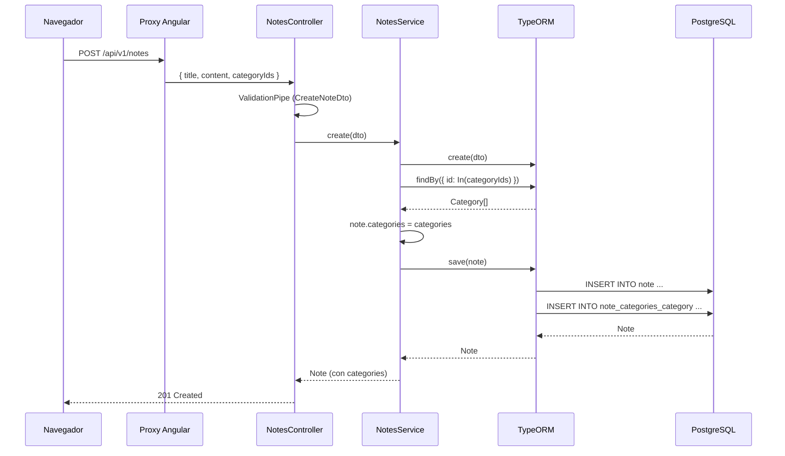
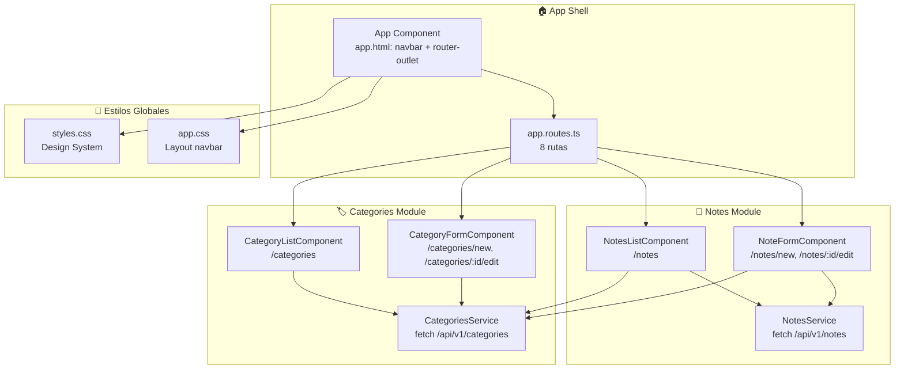
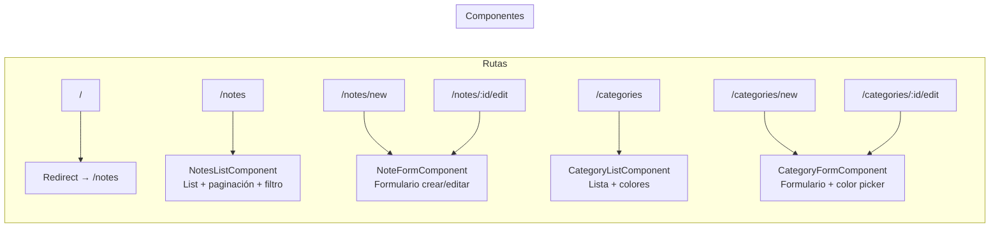
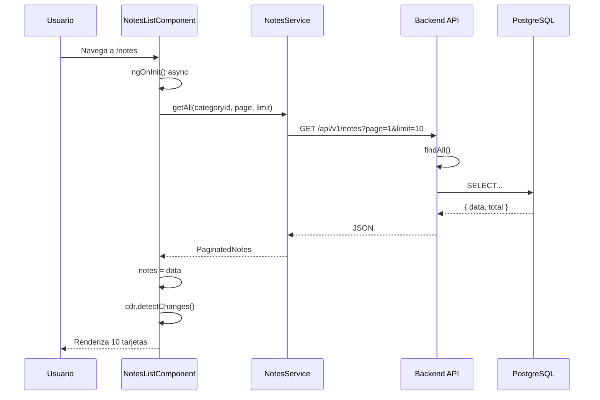
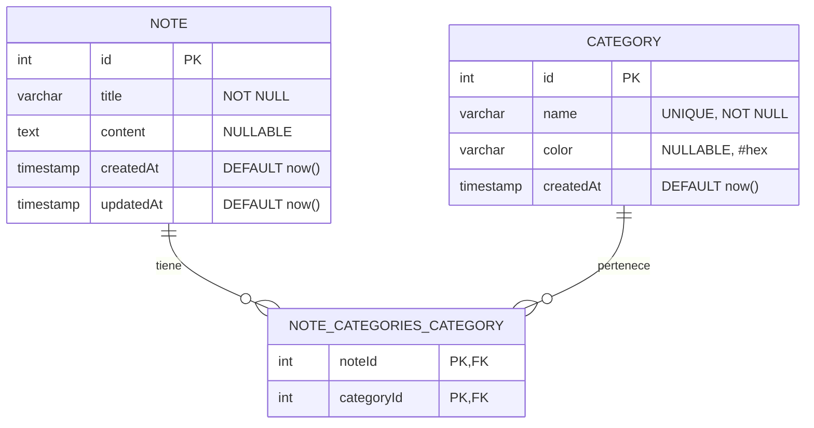

# Arquitectura — ejsimple-sdd

## Arquitectura General



---

## Arquitectura Backend (NestJS)



### Capas del Backend



### Flujo de una Petición (ej: GET /api/v1/notes)



### Flujo de Creación (ej: POST /api/v1/notes)



---

## Arquitectura Frontend (Angular)



### Componentes y Rutas



### Flujo de Carga de Datos



---

## Base de Datos

### Diagrama Entidad-Relación



### Diccionario de Datos

#### Tabla: `note`

| Columna     | Tipo                  | Restricciones        | Descripción                             |
|-------------|-----------------------|----------------------|-----------------------------------------|
| `id`        | `SERIAL`              | `PRIMARY KEY`        | Identificador único auto-incremental    |
| `title`     | `VARCHAR(255)`        | `NOT NULL`           | Título de la nota                       |
| `content`   | `TEXT`                | `NULLABLE`           | Contenido opcional de la nota           |
| `createdAt` | `TIMESTAMP`           | `NOT NULL DEFAULT NOW()` | Fecha de creación                  |
| `updatedAt` | `TIMESTAMP`           | `NOT NULL DEFAULT NOW()` | Fecha de última actualización       |

```sql
CREATE TABLE note (
  id        SERIAL       PRIMARY KEY,
  title     VARCHAR(255) NOT NULL,
  content   TEXT,
  "createdAt" TIMESTAMP  NOT NULL DEFAULT NOW(),
  "updatedAt" TIMESTAMP  NOT NULL DEFAULT NOW()
);
```

#### Tabla: `category`

| Columna     | Tipo                  | Restricciones              | Descripción                           |
|-------------|-----------------------|----------------------------|---------------------------------------|
| `id`        | `SERIAL`              | `PRIMARY KEY`              | Identificador único auto-incremental  |
| `name`      | `VARCHAR(100)`        | `NOT NULL UNIQUE`          | Nombre de la categoría                |
| `color`     | `VARCHAR(7)`          | `NULLABLE`                 | Color hexadecimal (ej: `#4f46e5`)     |
| `createdAt` | `TIMESTAMP`           | `NOT NULL DEFAULT NOW()`   | Fecha de creación                     |

```sql
CREATE TABLE category (
  id        SERIAL        PRIMARY KEY,
  name      VARCHAR(100)  NOT NULL UNIQUE,
  color     VARCHAR(7),
  "createdAt" TIMESTAMP   NOT NULL DEFAULT NOW()
);
```

#### Tabla: `note_categories_category`

| Columna      | Tipo      | Restricciones                               | Descripción                     |
|--------------|-----------|---------------------------------------------|---------------------------------|
| `noteId`     | `INTEGER` | `PRIMARY KEY`, `FK → note(id) ON DELETE CASCADE` | ID de la nota             |
| `categoryId` | `INTEGER` | `PRIMARY KEY`, `FK → category(id)`          | ID de la categoría              |

```sql
CREATE TABLE note_categories_category (
  "noteId"     INTEGER NOT NULL REFERENCES note(id) ON DELETE CASCADE,
  "categoryId" INTEGER NOT NULL REFERENCES category(id),
  PRIMARY KEY ("noteId", "categoryId")
);
```
