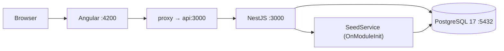

# Guía Rápida — ejsimple-sdd

App de notas full-stack: NestJS + Angular + PostgreSQL + Docker.

---

## 1. Clonar

```bash
git clone https://github.com/Elgarrido81/ejsimple-sdd.git
cd ejsimple-sdd
```

## 2. Requisito único

```bash
docker --version            # 27.x
docker compose version      # 2.x
```

Solo Docker. No necesitás Node, npm, Angular CLI ni PostgreSQL instalados.

## 3. Levantar

```bash
docker compose up --build -d
```

Esperá 10-15 segundos a que la DB arranque y la API haga el seed automático (12 notas + 4 categorías).

## 4. URLs

| Qué | URL |
|---|---|
| Frontend | http://localhost:4200 |
| Swagger (API docs) | http://localhost:3000/api |
| Notas endpoint | http://localhost:3000/api/v1/notes |
| Categorías endpoint | http://localhost:3000/api/v1/categories |

## 5. Probar con curl

```bash
curl http://localhost:3000/api/v1/notes?page=1&limit=5

curl http://localhost:3000/api/v1/categories

curl -X POST http://localhost:3000/api/v1/notes \
  -H "Content-Type: application/json" \
  -d '{"title":"Mi nota","content":"desde curl"}'
```

## 6. Comandos útiles

```bash
docker compose ps           # Estado de contenedores
docker compose logs api     # Logs del backend (seed incluido)
docker compose logs -f      # Logs en vivo de todos
docker compose down         # Apagar (datos preservados)
docker compose down -v      # Apagar y borrar DB (empezar de cero)
```

## 7. Desarrollo local (sin Docker)

```bash
# Terminal 1
cd api && npm install && npm run start:dev

# Terminal 2
cd ui && npm install && ng serve
```

Requiere PostgreSQL corriendo en local.

## 8. Arquitectura


