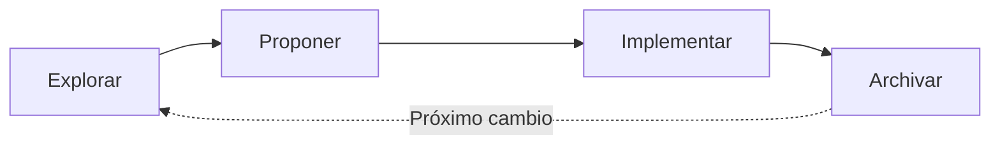

# OpenSpec SDD — ejsimple-sdd

Este proyecto utiliza **OpenSpec SDD** (Specification-Driven Development) para gestionar el desarrollo de features.

## ¿Qué es OpenSpec SDD?

OpenSpec SDD es un flujo de trabajo donde:

1. **Explorar** — Investigar el problema, entender requerimientos, diseñar solución
2. **Proponer** — Escribir spec, diseño y tareas en un `change` temporal
3. **Implementar** — Construir siguiendo las tareas
4. **Archivar** — Mover el change a `changes/archive/`

Cada cambio deja un artefacto en `changes/archive/` con:

| Archivo       | Contenido                                          |
|---------------|-----------------------------------------------------|
| `proposal.md` | Resumen ejecutivo del cambio                        |
| `design.md`   | Contexto, goals, non-goals, decisiones técnicas     |
| `tasks.md`    | Lista de tareas checklist                           |
| `specs/`      | Especificaciones Gherkin (features + escenarios)    |

## Estructura

```
openspec/
├── README.md                      ← Este archivo
├── specs/                         ← Especificaciones activas
│   ├── notes/spec.md              ← Gherkin: CRUD de notas
│   └── categories/spec.md         ← Gherkin: CRUD de categorías
└── changes/archive/               ← Cambios completados
    ├── 2026-07-07-core-notes/     ← Cambio 1: CRUD de notas
    │   ├── proposal.md
    │   ├── design.md
    │   ├── tasks.md
    │   └── specs/notes/spec.md
    └── 2026-07-07-categories/     ← Cambio 2: CRUD de categorías
        ├── proposal.md
        ├── design.md
        ├── tasks.md
        ├── specs/notes/spec.md    ← Spec de notas actualizado
        └── specs/categories/spec.md
```

## Flujo de Trabajo



## Especificaciones

### Notes (`specs/notes/spec.md`)

```gherkin
Feature: Notes CRUD
  As a user, I want to create, read, update and delete notes
  so that I can manage my personal notes with categories.

  Scenario: Create note with categories
    Given I am on the notes page
    When I click "+ Nueva Nota"
    And I fill "title" with "Mi nota"
    And I select category "Trabajo"
    And I click "Guardar"
    Then I see "Mi nota" in the notes list
```

### Categories (`specs/categories/spec.md`)

```gherkin
Feature: Categories CRUD
  As a user, I want to create, read, update and delete categories
  so that I can organize my notes.

  Scenario: Create category with color
    Given I am on the categories page
    When I click "+ Nueva Categoría"
    And I fill "name" with "Salud"
    And I fill "color" with "#ef4444"
    And I click "Guardar"
    Then I see "Salud" in the categories list
```

## Cambios Implementados

| Cambio                       | Fecha       | Descripción                              |
|------------------------------|-------------|------------------------------------------|
| `core-notes`                 | 2026-07-07  | CRUD de notas (API + UI)                 |
| `categories`                 | 2026-07-07  | CRUD de categorías + relación M:N notas  |
